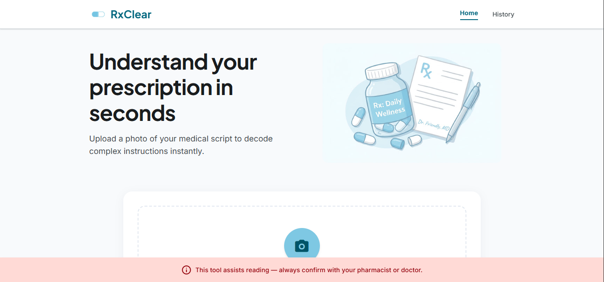
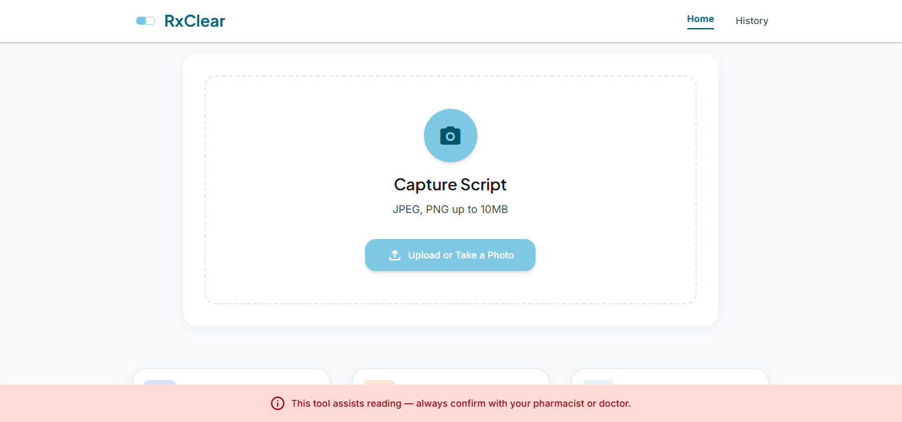
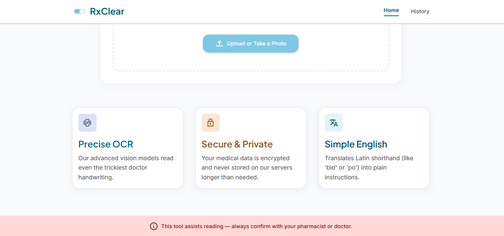
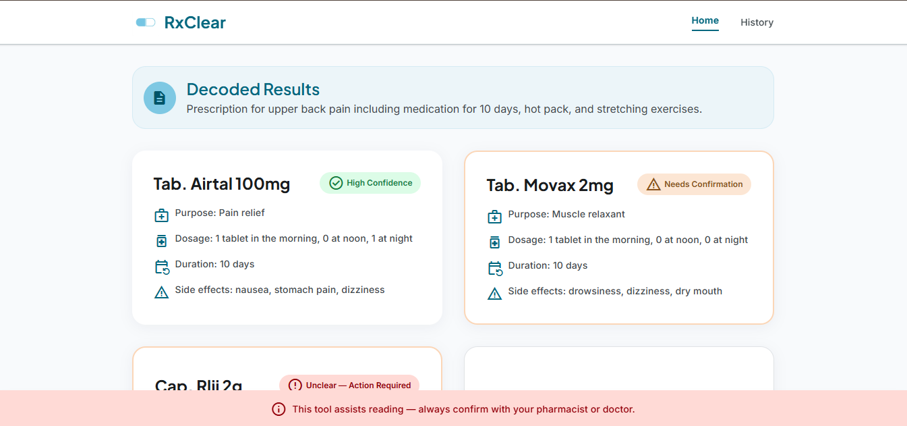
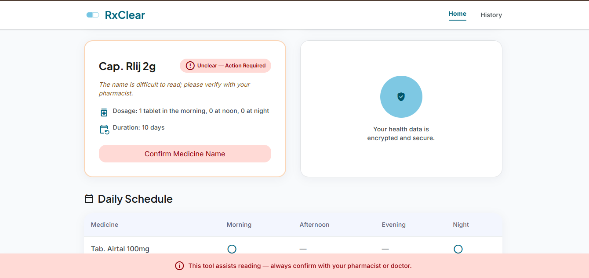
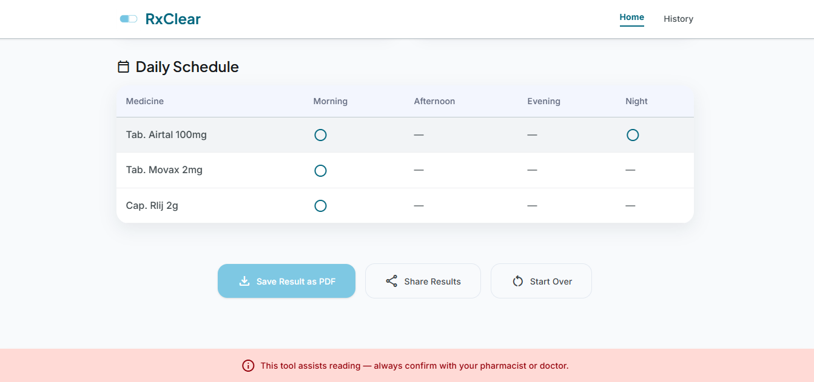
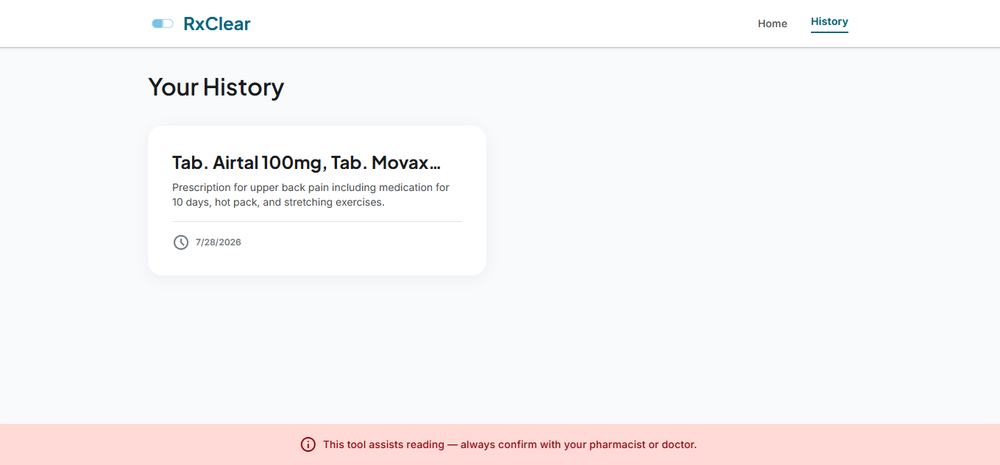

# RxClear — Understand Your Prescription in Seconds

## a. What it does & the problem it solves

**RxClear** is a web app that helps patients read and understand handwritten or printed medical prescriptions. Doctors' handwriting is frequently illegible, and prescriptions are full of abbreviations and shorthand that most patients — especially elderly people, people with limited literacy, or anyone unfamiliar with medical terminology — simply cannot decode on their own. This leads to missed doses, incorrect dosing, confusion at the pharmacy, and unnecessary anxiety about one's own health.

**Who it's for:** patients and caregivers who want to double-check and understand a prescription in plain language before taking it to the pharmacy — without needing to wait for a phone call back from the doctor or make an extra trip just to ask "what does this say?"

**Core design decision:** rather than pretending to confidently decode every prescription (which risks dangerous misinformation on illegible handwriting), RxClear's AI explicitly rates its own confidence per medicine — **High Confidence / Needs Confirmation / Unclear — Action Required** — and tells the user honestly when something needs pharmacist confirmation instead of guessing. This is the single most important design choice in the app: it's built to be a responsible reading aid, not a false authority. In the example shown in the screenshots below, the app correctly flagged "Cap. Rlij 2g" as unclear rather than guessing at a specific drug name, and prompted the user to confirm it with their pharmacist.

> ⚠️ **RxClear is a reading-assistance tool, not a medical diagnosis tool.** It does not replace professional advice — always confirm with a doctor or pharmacist before taking any medication.

---

## b. Live URL

**🔗 [https://rx-clear-liard.vercel.app/](https://rx-clear-liard.vercel.app/)**

---

## c. Features

- 📸 **Upload or capture a prescription photo** directly from a device camera or file picker (JPEG/PNG up to 10MB)
- 🖼️ **Image preview** before submitting, with a "Retake Photo" option
- 🤖 **AI-powered decoding** — reads the prescription and returns a structured, plain-language explanation
- 💊 **Per-medicine breakdown**, including:
  - Medicine name (as read)
  - Purpose / what it treats, explained in plain language
  - Dosage & frequency
  - Duration of treatment
  - Common side effects
  - **Confidence rating** — "High Confidence," "Needs Confirmation," or "Unclear — Action Required," with a clear explanatory note when something is uncertain
- 🗓️ **Auto-generated daily schedule** — a Morning / Afternoon / Evening / Night table showing exactly when to take each medicine
- 🔒 **Private, anonymous history** — every user gets a silent, invisible anonymous session (no login, no signup, no personal information collected) so their past scans stay private to them and are never mixed with anyone else's
- 📋 **History screen** — revisit past decoded prescriptions
- 📄 **Save Result as PDF** — download the decoded results for offline reference or to show a pharmacist
- 🔗 **Share Results** — quickly share the decoded prescription summary
- ⚠️ **Persistent safety disclaimer** shown on every screen
- 🛡️ **Graceful error handling** — unreadable images, AI service hiccups, and rate limits all show honest, calm messages instead of crashing or displaying raw errors
- 📱 **Fully responsive** — works on both desktop and mobile browsers

---

## d. The AI feature

**What it does:** The core AI feature reads an uploaded prescription image using a vision-capable large language model and returns a structured, honest explanation — including an explicit confidence rating per medicine, so the user always knows what to trust and what to double-check with a pharmacist.

**The exact system prompt used:**

```
You are a prescription reading assistant for patients (not doctors). Never diagnose or change doses.
Assign per-medicine confidence: high, medium, or low. If confidence is low, do not guess the drug name; describe what you see.
Never invent text not visible in the image. If the image is not a prescription or is unreadable, return readable:false JSON.

Return ONLY valid JSON (no markdown, no extra text). Schema:

{"readable":true,"summary":"string","medicines":[{"name":"string","confidence":"high"|"medium"|"low","purpose":"string|null","dosage":"string|null","duration":"string|null","side_effects":["string"],"note":"string|null"}],"schedule":{"morning":[],"afternoon":[],"evening":[],"night":[]}}

If unreadable: {"readable":false,"reason":"short explanation"}

```

**Why this matters:** the confidence-flagging behavior is intentional and is the core "instructions I wrote myself" piece of this project — it directly shapes the model into refusing to hallucinate a drug name when handwriting is genuinely illegible, instead surfacing uncertainty honestly to the user, and even providing a "Confirm Medicine Name" call-to-action for the pharmacist visit. This was iteratively tested and tuned against real prescription photos with varying handwriting quality.

---

## e. Tools, services, and AI models used

| Category | Tool/Service |
|---|---|
| Frontend & Backend | Next.js (App Router), React, TypeScript, Tailwind CSS |
| AI Model | Google Gemini (vision-capable model), called server-side via a dedicated API route |
| Database | Firebase Firestore (private, per-user history via Firebase Anonymous Authentication) |
| UI Design | Google Stitch (initial screen designs and component styling) |
| Development / Build Assistance | Antigravity and Cursor (AI coding agents used to implement the functional app on top of the designed UI) |
| Hosting | Vercel |
| Version Control | Git / GitHub (public repository) |

---

## f. Screenshots

**Home screen**


**Upload area**


**Feature highlights**


**Decoded results — High Confidence & Needs Confirmation**


**Decoded results — Unclear medicine flagged for pharmacist confirmation**


**Daily schedule & export options**


**History screen**


---

## g. How to run this project locally

### Prerequisites
- Node.js (v18 or later)
- A free Gemini API key (Google AI Studio)
- A free Firebase project with Firestore enabled and Anonymous Authentication enabled

### Setup steps

```bash
# 1. Clone the repository
git clone https://github.com/areefasamar/RxClear.git
cd RxClear

# 2. Install dependencies
npm install

# 3. Create a .env.local file in the project root with the following:
GEMINI_API_KEY=your_key_here
NEXT_PUBLIC_FIREBASE_API_KEY=your_firebase_api_key
NEXT_PUBLIC_FIREBASE_AUTH_DOMAIN=your_project.firebaseapp.com
NEXT_PUBLIC_FIREBASE_PROJECT_ID=your_project_id
NEXT_PUBLIC_FIREBASE_STORAGE_BUCKET=your_project.appspot.com
NEXT_PUBLIC_FIREBASE_MESSAGING_SENDER_ID=your_sender_id
NEXT_PUBLIC_FIREBASE_APP_ID=your_app_id

# 4. Run the development server
npm run dev

# 5. Open http://localhost:3000 in your browser
```

### Deployment
This project is deployed on **Vercel**. To deploy your own copy:
1. Push this repository to your own GitHub account
2. Import it into Vercel (vercel.com → New Project → select the repo)
3. Add all the environment variables listed above in Vercel's Project Settings → Environment Variables
4. Deploy

---

## A note on responsible design

No login, signup, or personal information (name, phone number, etc.) is ever collected. Each user's history stays private through an invisible, anonymous session — protecting privacy without adding any friction to a tool meant to be used quickly, often by people who are worried about their health in the moment.
